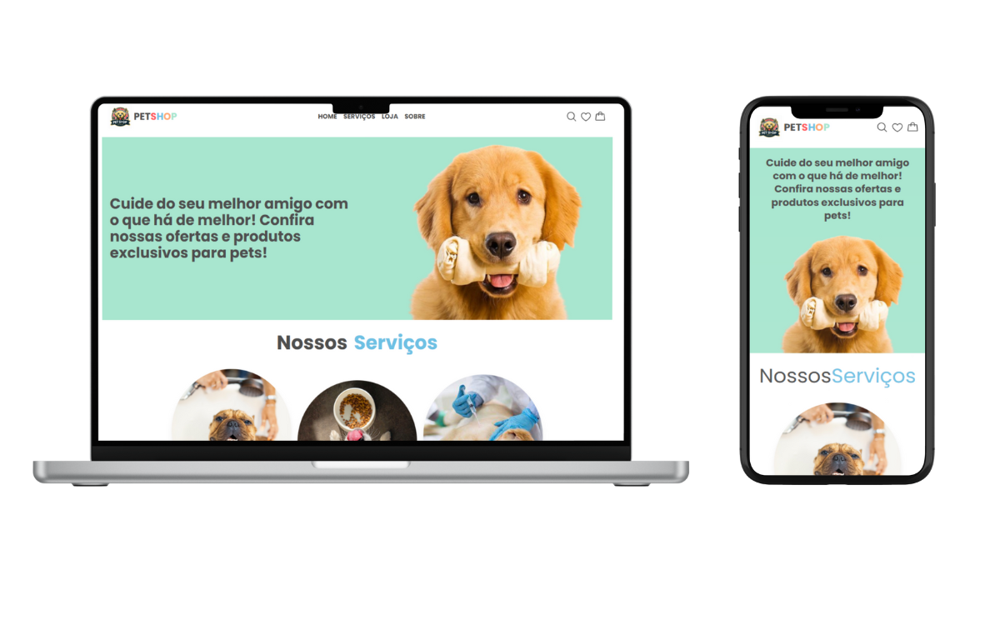

# PetShop

💻 [Deploy](https://devpetshop.vercel.app/) 🌐

## Descrição 📋

Site de um PetShop, para divulgar a loja. Na loja você tem a função de favoritos, detalhes do produto, adicionar ou remover do carrinho além da landing page do Petshop.

## Layout 🎨



## Funcionalidades Principais ✨

- Landing page do PetShop
- Funcionalidade de favoritos
- Detalhes do produto
- Adicionar ou remover do carrinho

## Tecnologias Utilizadas 🛠️

- Figma
- React
- TypeScript
- Tailwind CSS
- Axios
- json-server
- Vite
- Phosphor Icons
- react-hot-toast
- react-router-dom
- ESLint

## Requisitos do Sistema 💻

- Node.js (versão 18.2.0 ou superior)
- npm (versão 8.19.2 ou superior)

## Instruções de Instalação 🛠️

1. Clone o repositório:

   ```bash
   git clone https://github.com/erivamjr/devpetshop.git
   ```

2. Instale as dependências:

   ```bash
   cd petshop
   npm install
   ```

3. Inicie o servidor de desenvolvimento:

   ```bash
   npm run dev
   ```

4. (Opcional) Caso queira pegar os produtos do json-server, tera que:

- Para visualizar a aplicação, acesse http://localhost:3000 no seu navegador.
- Para simular a API, comente as linhas 3 e 37 e descomente as linhas 2 e 36 do arquivo ProductsContext.tsx.

  ```bash
  npm run server
  ```

## Contribuição 🤝

Contribuições são bem-vindas! Se você tiver alguma ideia ou melhoria, sinta-se à vontade para abrir um pull request.

## Autor 👤

[José Erivam](https://www.linkedin.com/in/erivamjr/).

# [ESCOLHA IDIOMA](README.md)
